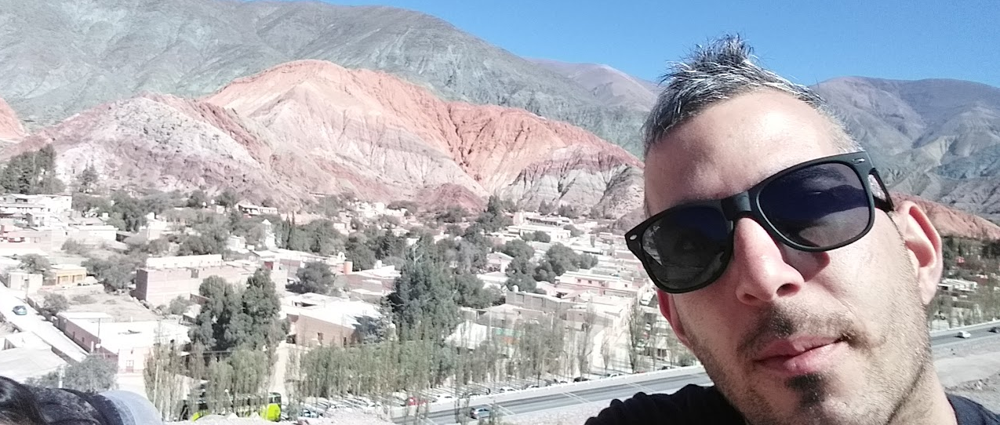

<h1 align="center">Hola, soy Martin Bottaro👋</h1>

## Sobre mi

- 📲 Full Stack developer
- 📗 Diplomatura de Full Stack Developer (UTN).
- 🧑 Pofesional, Dedicado y Detallista. Siempre en la busqueda de superarme a mi mismo, me desempeño de la mejor forma posible, proactivo y aceptando los retos que aperecen dia a dia, resolviendolos de la mejor manera, optimizando y cumpliendo con las expectativas.

                                                                                   

### 🛠 &nbsp;Tech Stack

&nbsp;
&nbsp;
&nbsp;
&nbsp;
\
&nbsp;
&nbsp;
&nbsp;
\
&nbsp;
&nbsp;
&nbsp;
&nbsp;
\
&nbsp;
&nbsp;

### ⚙️ &nbsp;GitHub Analytics

  

